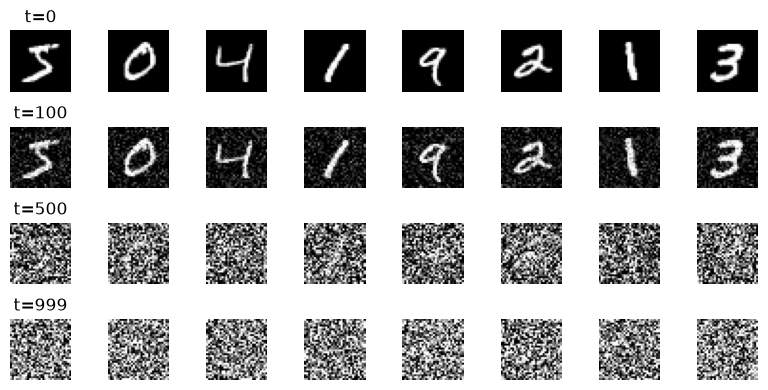
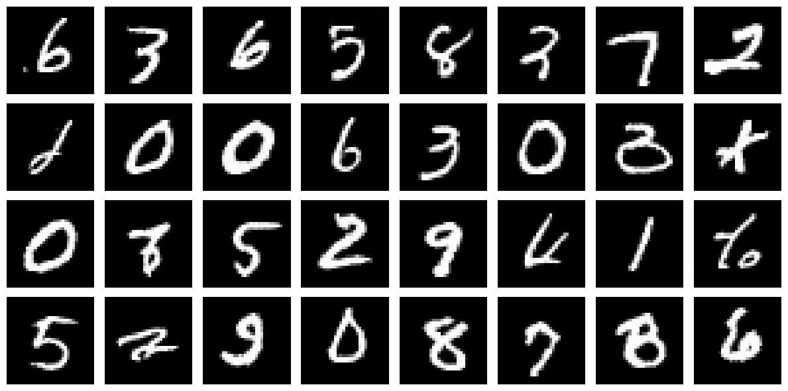

# Learning Diffusion Models


*Forward Process (Noising)*


*Samples From the Reverse Process (Denoising)*

## What Is This Repository About?

This is a learning project based on my interests. The first implementation is currently complete and it is an implementation of DDPM from scratch using PyTorch and the MNIST dataset. No AI agents were used for any implementation. **Every line was typed by me**. The AI is still used though for asking questions and understanding the material better. The LLM explained the mathematics, reviewed my code for bugs, and answered questions. So basically AI was used in an assistant/teacher role in this project.

The project is first implemented and explored in Jupyter notebooks. And then reorganized into modules to be able to run from terminal and import into Jupyter notebook environments for further experiments and tests.

The learning process includes discussing with friends who are experts in this area, watching YouTube videos (the two that helped most are linked below), reading blogs, and discussing with AI agents and LLM chatbots.

The first training has run on my M1 MacBook with a batch size of 128, for 40 epochs. It took around 4 hours.

## What "From Scratch" Means

**Written by hand:** the noise schedule, the closed form, the timestep embedding,
the UNet, the training loop, the sampler.

**Imported:** `torch` primitives (`nn.Conv2d`, `nn.GroupNorm`, `AdamW`),
`torchvision` for the dataset.

**Deliberately not used:** `diffusers` — importing `DDPMScheduler` and `UNet2DModel`
would have made this a config file.

## Results

|                    |                                                            |
| ------------------ | ---------------------------------------------------------- |
| UNet parameters    | 2,819,137                                                  |
| Untrained baseline | 1.00 (a model predicting zeros scores exactly `E[ε²] = 1`) |
| Stub CNN, 2 epochs | ≈ 0.14                                                     |
| UNet, 40 epochs    | 0.0162                                                     |
| Training           | M1 8 GB, batch 128, ~3 h 40 m                              |
| Sampling           | 1000 ancestral steps, ~12 s for 8 samples                  |

## Repo Layout

```
diffusion-lab/
├── ddpm/
│   ├── schedule.py     beta / alpha-bar schedule, closed-form q(x_t | x_0)
│   ├── model.py        sinusoidal timestep embedding, ResBlock, UNet
│   ├── sampling.py     DDPM ancestral sampler
│   └── data.py         dataset + transforms
├── notebooks/
│   ├── 01_forward_process.ipynb   deriving and verifying the forward process
│   └── 02_unet_training.ipynb     baseline, architecture checks, samples
├── train.py            CLI training script
└── README.md
```

## Running It

```bash
uv sync
uv run python train.py --epochs 40
```

## Status and Next Steps

My learning journey is always continuing. And more will be added to this repo soon. The dataset will change from MNIST to other richer datasets with RGB channels and it will be difficult to train locally even for a bit. Therefore, my further plan is to use Google Colab and/or rent an RTX 4090 instance so that I have more computational power.

## References

- Ho et al., 2020 — [*Denoising Diffusion Probabilistic Models*](https://arxiv.org/abs/2006.11239). The paper this implements.

Videos that helped most:

- [Give me 50 min, I will make Diffusion Model click forever (Zachary Huang)](https://www.youtube.com/watch?v=JOqU8_qJQg4)
- [But how do AI images and videos actually work? | Guest video by Welch Labs (3Blue1Brown & Welch Labs)](https://www.youtube.com/watch?v=iv-5mZ_9CPY)
